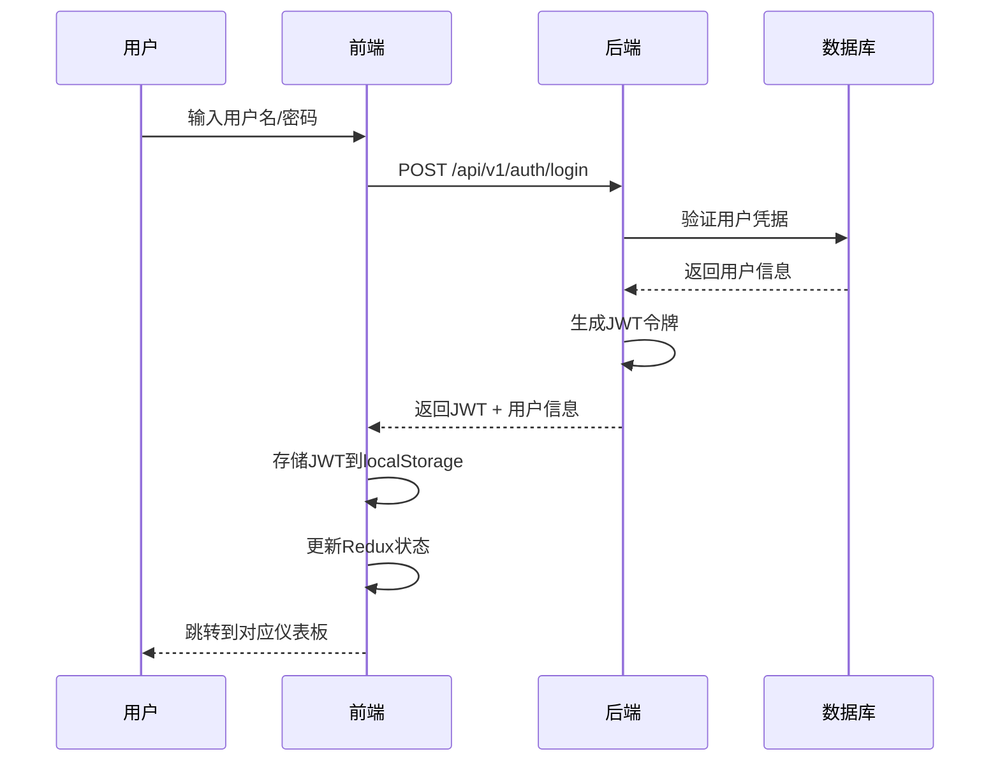

# 用户认证系统设计文档

## 概述

用户认证系统采用前后端分离架构，前端使用React + Redux Toolkit进行状态管理，后端使用Spring Boot + Spring Security + JWT实现安全认证。系统支持基于角色的访问控制(RBAC)，为不同用户角色提供差异化的功能访问权限。

## 架构设计

### 整体架构

```
┌─────────────────┐    HTTP/HTTPS     ┌─────────────────┐
│   React前端     │ ◄──────────────► │  Spring Boot    │
│                 │                   │     后端        │
│ - 登录/注册页面  │                   │                 │
│ - 用户状态管理   │                   │ - JWT认证       │
│ - 路由守卫      │                   │ - 用户管理API   │
│ - 个人资料页面   │                   │ - 权限控制      │
└─────────────────┘                   └─────────────────┘
                                               │
                                               ▼
                                      ┌─────────────────┐
                                      │   PostgreSQL    │
                                      │     数据库      │
                                      │                 │
                                      │ - users表       │
                                      │ - 用户认证信息   │
                                      └─────────────────┘
```

### 认证流程



## 组件和接口设计

### 前端组件架构

#### 1. 认证相关组件
- `LoginPage` - 登录页面组件
- `RegisterPage` - 注册页面组件  
- `ProfilePage` - 个人资料页面组件
- `ProtectedRoute` - 路由守卫组件
- `AuthLayout` - 认证页面布局组件

#### 2. Redux状态管理
```javascript
// authSlice.js
const authSlice = createSlice({
  name: 'auth',
  initialState: {
    user: null,
    token: null,
    isAuthenticated: false,
    loading: false,
    error: null
  },
  reducers: {
    loginStart: (state) => { state.loading = true },
    loginSuccess: (state, action) => {
      state.user = action.payload.user
      state.token = action.payload.token
      state.isAuthenticated = true
      state.loading = false
      state.error = null
    },
    loginFailure: (state, action) => {
      state.loading = false
      state.error = action.payload
    },
    logout: (state) => {
      state.user = null
      state.token = null
      state.isAuthenticated = false
    }
  }
})
```

#### 3. API服务层
```javascript
// authService.js
class AuthService {
  async login(credentials) {
    const response = await api.post('/auth/login', credentials)
    return response.data
  }
  
  async register(userData) {
    const response = await api.post('/auth/register', userData)
    return response.data
  }
  
  async getCurrentUser() {
    const response = await api.get('/auth/me')
    return response.data
  }
  
  async updateProfile(profileData) {
    const response = await api.put('/auth/profile', profileData)
    return response.data
  }
}
```

### 后端API设计

#### 1. 控制器层
```java
@RestController
@RequestMapping("/api/v1/auth")
public class AuthController {
    
    @PostMapping("/login")
    public ResponseEntity<ApiResponse<LoginResponse>> login(@RequestBody LoginRequest request)
    
    @PostMapping("/register") 
    public ResponseEntity<ApiResponse<RegisterResponse>> register(@RequestBody RegisterRequest request)
    
    @GetMapping("/me")
    public ResponseEntity<ApiResponse<UserResponse>> getCurrentUser(Authentication auth)
    
    @PutMapping("/profile")
    public ResponseEntity<ApiResponse<UserResponse>> updateProfile(@RequestBody UpdateProfileRequest request, Authentication auth)
}
```

#### 2. 服务层
```java
@Service
public class AuthService {
    
    public LoginResponse login(LoginRequest request)
    public RegisterResponse register(RegisterRequest request)  
    public UserResponse getCurrentUser(Long userId)
    public UserResponse updateProfile(Long userId, UpdateProfileRequest request)
    public String generateJwtToken(User user)
    public boolean validateJwtToken(String token)
}
```

#### 3. 安全配置
```java
@Configuration
@EnableWebSecurity
public class SecurityConfig {
    
    @Bean
    public SecurityFilterChain filterChain(HttpSecurity http) throws Exception {
        http.csrf().disable()
            .sessionManagement().sessionCreationPolicy(SessionCreationPolicy.STATELESS)
            .and()
            .authorizeHttpRequests(authz -> authz
                .requestMatchers("/api/v1/auth/login", "/api/v1/auth/register").permitAll()
                .requestMatchers("/api/v1/admin/**").hasRole("ADMIN")
                .requestMatchers("/api/v1/instructor/**").hasRole("INSTRUCTOR")
                .anyRequest().authenticated()
            )
            .addFilterBefore(jwtAuthenticationFilter, UsernamePasswordAuthenticationFilter.class);
        return http.build();
    }
}
```

## 数据模型

### 用户实体设计
```java
@Entity
@Table(name = "users")
public class User {
    @Id
    @GeneratedValue(strategy = GenerationType.IDENTITY)
    private Long id;
    
    @Column(unique = true, nullable = false)
    private String username;
    
    @Column(nullable = false)
    private String passwordHash;
    
    @Column(unique = true)
    private String email;
    
    private String avatarUrl;
    
    @Enumerated(EnumType.STRING)
    private UserRole role;
    
    private LocalDateTime createdAt;
    private LocalDateTime updatedAt;
}

public enum UserRole {
    STUDENT, INSTRUCTOR, ADMIN
}
```

### 数据传输对象(DTO)
```java
// 登录请求
public class LoginRequest {
    private String username;
    private String password;
}

// 登录响应
public class LoginResponse {
    private String accessToken;
    private String tokenType;
    private UserResponse user;
}

// 用户信息响应
public class UserResponse {
    private Long userId;
    private String username;
    private String email;
    private String avatarUrl;
    private UserRole role;
}
```

## 错误处理

### 前端错误处理
```javascript
// 全局错误处理中间件
const errorMiddleware = (store) => (next) => (action) => {
  if (action.type.endsWith('/rejected')) {
    const error = action.payload
    if (error.status === 401) {
      store.dispatch(logout())
      window.location.href = '/login'
    }
    // 显示错误提示
    notification.error({
      message: '操作失败',
      description: error.message
    })
  }
  return next(action)
}
```

### 后端错误处理
```java
@ControllerAdvice
public class GlobalExceptionHandler {
    
    @ExceptionHandler(AuthenticationException.class)
    public ResponseEntity<ApiResponse<Void>> handleAuthenticationException(AuthenticationException ex) {
        return ResponseEntity.status(401)
            .body(ApiResponse.error(401, "认证失败: " + ex.getMessage()));
    }
    
    @ExceptionHandler(AccessDeniedException.class)
    public ResponseEntity<ApiResponse<Void>> handleAccessDeniedException(AccessDeniedException ex) {
        return ResponseEntity.status(403)
            .body(ApiResponse.error(403, "访问被拒绝"));
    }
}
```

## 测试策略

### 前端测试
1. **单元测试** - 使用Jest + React Testing Library测试组件
2. **集成测试** - 测试Redux状态管理和API调用
3. **E2E测试** - 使用Cypress测试完整的用户认证流程

### 后端测试
1. **单元测试** - 使用JUnit 5测试服务层逻辑
2. **集成测试** - 使用@SpringBootTest测试API端点
3. **安全测试** - 测试JWT认证和权限控制

### 测试用例示例
```java
@SpringBootTest
@AutoConfigureTestDatabase
class AuthControllerTest {
    
    @Test
    void shouldLoginSuccessfully() {
        // 测试正确的用户名密码登录
    }
    
    @Test
    void shouldReturnErrorForInvalidCredentials() {
        // 测试错误的用户名密码
    }
    
    @Test
    void shouldRequireAuthenticationForProtectedEndpoints() {
        // 测试受保护端点的认证要求
    }
}
```

## 安全考虑

### JWT安全
1. **令牌过期时间** - 设置合理的过期时间(24小时)
2. **密钥管理** - 使用强随机密钥，定期轮换
3. **令牌刷新** - 实现令牌刷新机制避免频繁登录
4. **XSS防护** - 避免在localStorage中存储敏感信息

### 密码安全
1. **密码加密** - 使用BCrypt进行密码哈希
2. **密码强度** - 前端验证密码复杂度要求
3. **防暴力破解** - 实现登录失败次数限制

### API安全
1. **HTTPS传输** - 生产环境强制使用HTTPS
2. **CORS配置** - 正确配置跨域访问策略
3. **输入验证** - 严格验证所有用户输入
4. **SQL注入防护** - 使用参数化查询

## 性能优化

### 前端优化
1. **代码分割** - 按路由进行代码分割
2. **缓存策略** - 合理缓存用户信息和静态资源
3. **懒加载** - 非关键组件懒加载

### 后端优化  
1. **数据库索引** - 为用户名和邮箱字段创建索引
2. **连接池** - 配置合适的数据库连接池
3. **缓存** - 使用Redis缓存用户会话信息