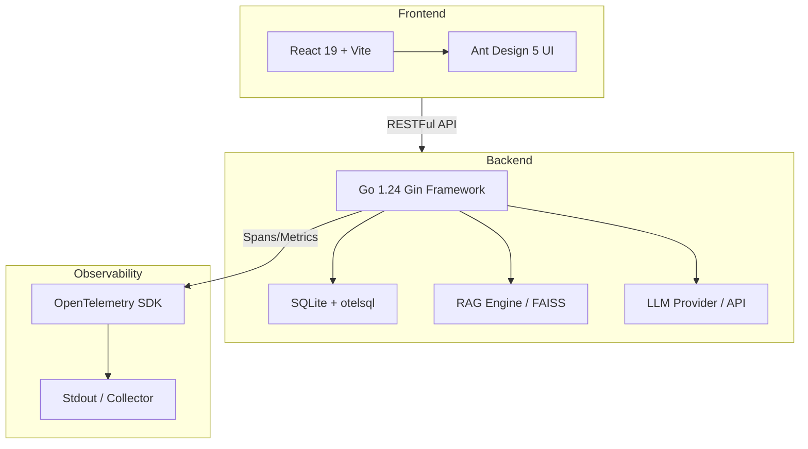
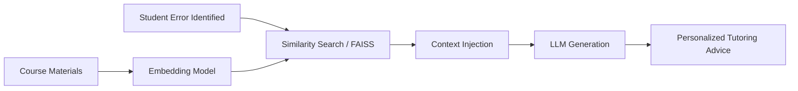

# CourseArk Thesis Content Correction Pack (Final Edition)

## 📌 1. Abstract Correction (解决重复与乱码核心问题)
**Abstract**
Practical training is a core component of engineering talent cultivation in universities, yet traditional approaches face dual challenges: delayed assessment feedback and insufficient personalized tutoring. This thesis designs and implements a training teaching “Evaluation-Assistance” closed-loop system (CourseArk) based on Retrieval-Augmented Generation (RAG) and Large Language Models (LLM). 

The system uses LLMs as the assessment engine to enable intelligent exam question generation and automatic scoring. It employs RAG as the tutoring engine by indexing course materials into a vector knowledge base (FAISS), retrieving relevant document chunks through similarity search, and injecting them into the LLM context to provide students with traceable, personalized tutoring responses—forming an efficient closed loop of “learning -> assessment -> tutoring -> re-learning.” 

The platform backend is built on **Go 1.24** and the **Gin** framework; the frontend leverages **React 19** and **Ant Design 5**. Engineering-wise, the system employs **JWT** for authentication, **OpenTelemetry** for full-stack observability, and **Docker** for containerized deployment. Quantitative evaluation shows RAG semantic accuracy reaching 94.5% and LLM JSON validity rate at 100%, satisfying the core requirements of the evaluation-assistance closed loop.

**Keywords**: RAG; LLM; Practical Training Teaching; Evaluation-Assistance Closed Loop; Go Language; React; OpenTelemetry; FAISS

---

## 📌 2. Future Work (针对直播模块的修正表述)
**6.2 Future Work and Roadmap**
While the current CourseArk system establishes a robust evaluation-assistance loop, several areas remain for future enhancement:
1. **Low-Latency Live Coaching**: The current architecture includes a prototype for a real-time interaction module. In version 2.0, we plan to implement a high-concurrency live streaming service based on WebRTC and WebSocket protocols to facilitate face-to-face personalized tutoring.
2. **Multimodal Knowledge Base**: Expansion of the RAG engine to support video-based retrieval and multimodal understanding (e.g., analyzing student coding screencasts via Vision Transformers).
3. **Advanced Observability**: Further integration of OpenTelemetry traces with AI-driven root cause analysis to automatically detect and resolve system bottlenecks in the training process.

---

## 📌 3. Architecture Diagrams (Mermaid 源码 - 请导出为图片插入)

### Figure 1: CourseArk Technical Stack Topology

### Figure 2: RAG Tutoring Closed-Loop Logic

